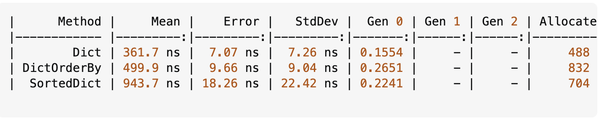

И так что же нам надо знать о интерфейсах:

1. Что такое интерфейс ?
2. Как создать интерфейс и надо ли его создавать ?
3. Сокрытие интерфейсов
4. Анализ встреченных интерфейсов

- - yield return

#### Что такое интерфейс ?

Интерфейс - это тип, описывающий поведение объектов. Он определяет набор методов и свойств, которые класс должен реализовать. Интерфейсы позволяют создавать гибкие и расширяемые архитектуры, так как они отделяют определение поведения от его реализации.

Мы обязаны реализовать все что есть в интерфейсе, если мы его наследуем(правильно будет сказать реализуем).

#### Как создать интерфейс и надо ли его создавать ?

Для того чтобы писать правильный, гибкий и расширяемый код, вам нужно понять где вам будут нужны интерфейсы. Здесь к сожалению нет универсального ответа, но я могу вам рассказать о том, как это делаю я.

1. При создании рабочих классов которые определяют часть логики приложения, я всегда создаю интерфейсы для них. В будущем если я буду менять реализацию класса или создам другой класс, мне не придется 1. пеереписывать код. Я просто поменяю interface reference. Пример приведу в проекте с интерфейсами.
2. При создании классов которым нужно дать одинаковое поведение, конкретно в этой ситуации речь идет о классах которые описывают бизнес модель. Пример:

```csharp
interface IBaseEntity
{
    public Guid Id { get; set; }
    public DateTime CreatedAt { get; set; }
    public DateTime UpdatedAt { get; set; }
}

class User : IBaseEntity
{
    public string UserName { get; set; }
    public string Email { get; set; }
    public Guid Id { get; set; }
    public DateTime CreatedAt { get; set; }
    public DateTime UpdatedAt { get; set; }
}

class Role : IBaseEntity
{
    public string Name { get; set; }
    public Guid Id { get; set; }
    public DateTime CreatedAt { get; set; }
    public DateTime UpdatedAt { get; set; }
}

class UserRole : IBaseEntity
{
    public Guid UserId { get; set; }
    public Guid RoleId { get; set; }

    public User User { get; set; }
    public Role Role { get; set; }
    public Guid Id { get; set; }
    public DateTime CreatedAt { get; set; }
    public DateTime UpdatedAt { get; set; }
}
```

3. При использовании DI (Dependency Injection). Ваша работа с DI будет проще, если вы будете использовать интерфейсы.

4. При реализации Dependency Inversion Principle. Это принцип из SOLID, который говорит о том, что модули верхнего уровня не должны зависеть от модулей нижнего уровня. Они должны зависеть от абстракций. Соответственно, если вы хотите реализовать этот принцип, вам нужно использовать интерфейсы.

#### [Почему писать готовую реализацию - это плохо](https://habr.com/ru/companies/piter/articles/471872/)

#### Сокрытие имен в интерфейсах

```csharp
interface IAnimal
{
    void Speak()
    {
        Console.WriteLine("Animal speaks");
    }
}

class Dog : IAnimal
{
    public void Speak() => Console.WriteLine("Dog barks");
}

class Cat : IAnimal
{
    public void Speak() => Console.WriteLine("Cat meows");
}
```

```csharp


ITeacher teacher = new MiddleMan();
IStudent student = new MiddleMan();

teacher.DisplayInfo(); // Calls the ITeacher implementation
student.DisplayInfo(); // Calls the IStudent implementation

interface IStudent
{
    public string Name { get; set; }
    public void DisplayInfo();
}

interface ITeacher
{
    public string Name { get; set; }
    public void DisplayInfo();
}

class MiddleMan : IStudent, ITeacher
{
    public string Name { get; set; }

    void IStudent.DisplayInfo()
    {
        Console.WriteLine("Student Info");
    }

    void ITeacher.DisplayInfo()
    {
        Console.WriteLine("Teacher Info");
    }
}

class Student : IStudent
{
    public string Name { get; set; }
    public int Age { get; set; }

    public void DisplayInfo()
    {
        Console.WriteLine($"Student Name: {Name}, Age: {Age}");
    }
}

class Teacher : ITeacher
{
    public string Name { get; set; }
    public string Subject { get; set; }

    public void DisplayInfo()
    {
        Console.WriteLine($"Teacher Name: {Name}, Subject: {Subject}");
    }
}
```

#### Анализ встреченных интерфейсов

Есть ряд встроенных интерфейсов, которые вам необходимо знать. Вот их список:

1. IDisposable - интерфейс, который определяет метод Dispose для освобождения ресурсов.
2. IComparable - интерфейс, который определяет метод CompareTo для сравнения объектов.
3. IEnumerable - интерфейс, который определяет метод GetEnumerator для перебора коллекции.
4. ICloneable - интерфейс, который определяет метод Clone для создания копии объекта.
5. IEquatable - интерфейс, который определяет метод Equals для сравнения объектов на равенство.
6. ICollection - интерфейс, который определяет методы для работы с коллекциями.

`IDisposable` - интерфейс, который определяет метод Dispose для освобождения ресурсов. Он используется для управления ресурсами, которые требуют явного освобождения, такими как файлы, сетевые соединения и т.д. Ключевое слово `using` автоматически вызывает метод Dispose, когда объект выходит из области видимости.

`IComparable` - интерфейс, который определяет метод CompareTo для сравнения объектов. Он позволяет сравнивать объекты одного типа и определять их порядок. Например, вы можете использовать его для сортировки коллекций.

Есть два вида его реализации:

1. Через реализацию интерфейса IComparable.
2. Через реализацию с помощью обобщенного интерфейса IComparable<T>.

```csharp

List<Person> people = new List<Person>
{
    new Person { Name = "Alice", Age = 30 },
    new Person { Name = "Bob", Age = 25 },
    new Person { Name = "Charlie", Age = 35 }
};

people.Sort(); // Сортировка по возрасту

class Person : IComparable<Person>
{
    public string Name { get; set; }
    public int Age { get; set; }

    public int CompareTo(Person other)
    {
        return Age.CompareTo(other.Age);
    }
}
```

`IEnumerable` - интерфейс, который определяет метод GetEnumerator для перебора коллекции. Он позволяет использовать `foreach` для перебора элементов коллекции. В свой очередь сам `IEnumerable` реализует интерфейс `IEnumerator`, который определяет методы для перебора коллекции.

То есть если вы хотите использовать `foreach` для перебора коллекции, вам нужно реализовать интерфейс `IEnumerable`. Данный интерфейс есть во всех коллекциях, которые есть в .NET.

```csharp

class MyCollection : IEnumerable<int>
{
    private List<int> _items = new List<int>();

    public void Add(int item)
    {
        _items.Add(item);
    }

    public IEnumerator<int> GetEnumerator()
    {
        foreach (var item in _items)
        {
            yield return item;
        }
    }

    IEnumerator IEnumerable.GetEnumerator()
    {
        return GetEnumerator();
    }
}
```

Давайте для примера IEnumerable рассмотрим коллекции которые есть в `.NET`:

- `List<T>` - представляет собой изменяемый список объектов.
- `Dictionary<TKey, TValue>` - представляет собой коллекцию пар ключ-значение.
- `HashSet<T>` - представляет собой коллекцию уникальных элементов.
- `Queue<T>` - представляет собой очередь, которая работает по принципу "первый пришел - первый вышел".
- `Stack<T>` - представляет собой стек, который работает по принципу "последний пришел - первый вышел".
- `LinkedList<T>` - представляет собой двусвязный список.
- `ArrayList` - представляет собой изменяемый массив объектов.
- `SortedList<TKey, TValue>` - представляет собой коллекцию пар ключ-значение, отсортированных по ключу.
- `SortedSet<T>` - представляет собой коллекцию уникальных элементов, отсортированных по возрастанию.
- `SortedDictionary<TKey, TValue>` - представляет собой коллекцию пар ключ-значение, отсортированных по ключу.
- `ObservableCollection<T>` - представляет собой коллекцию, которая уведомляет об изменениях в коллекции.

При чем стоит отметить что по умолчанию все массивы в C# тоже являются `IEnumerable`.

По началу типу `SortedList` и `SortedDictionary` могут показаться одинаковыми, но на самом деле они отличаются. `List` выступает как обычный массив, а `Dictionary` в качестве бинарного дерева.



## `ICloneable` - интерфейс, который определяет метод Clone для создания копии объекта. Он позволяет создавать поверхностные и глубокие копии объектов. Поверхностная копия создает новый объект, но не копирует вложенные объекты. Глубокая копия создает новый объект и копирует все вложенные объекты.


Зачем мне метод Clone в интерфейсе, если я могу сам написать метод Clone в класее ? Ответ на этот вопрос кроется не в клонировании а работе самих интерфейсов. Дело в том что при использовании интерфеса вы обязаны имплементировать этот метод, соответственно это дает гарантию того что объект может быть склонирован. Если у вас есть сервис который работает с несколькими объектами, то вы не буджете принимать обычные классы, а будете принимать интерфейсы. Соответственно вы можете быть уверены что у вас есть метод Clone, который вы можете использовать в своем сервисе. Вот пример: 

```csharp


Pc a = new()
{
    Name = "My PC",
    Components = new List<PcComponent>
    {
        new Cpu
        {
            Name = "Intel Core i7",
            Description = "High performance CPU",
            Socket = "LGA 1151",
            Cores = 8,
            Threads = 16,
            BaseClock = 3.6,
            BoostClock = 4.9
        },
        new Gpu
        {
            Name = "NVIDIA GeForce RTX 3080",
            Description = "High performance GPU",
            MemoryType = "GDDR6X",
            MemorySize = 10,
            CudaCores = 8704,
            BaseClock = 1440,
            BoostClock = 1710
        },
        new Motherboard
        {
            Name = "ASUS ROG Strix Z490-E",
            Description = "High performance motherboard",
            Socket = "LGA 1200",
            RamSlots = 4,
            MaxRam = 128,
            FormFactor = "ATX"
        }
    }
};
Pc b = a.Clone() as Pc;

b.Name = "My PC Clone";
b.Components[1].Name = "NVIDIA GeForce RTX 3090";
Console.WriteLine(a);
Console.WriteLine(b);

class Pc : ICloneable
{
    public Guid Id { get; set; } = Guid.NewGuid();
    public string Name { get; set; }
    public List<PcComponent> Components { get; set; }
    public object Clone()
    {
        var clonedComponents =  new List<PcComponent>();

        foreach (var component in Components)
        {
            clonedComponents.Add(component.Clone() as PcComponent);
        }

        return new Pc()
        {
            Id = Guid.NewGuid(),
            Name = this.Name,
            Components = clonedComponents
        };
    }

    public override string ToString()
    {
        return $"ID: {Id}\n\tName: {Name}\n\tComponents: {string.Join(", ", Components.Select(c => c.Name))}";
    }
}

class PcComponent : ICloneable
{
    public Guid Id { get; set; }
    public string Name { get; set; }
    public string Description { get; set; }
    public object Clone()
    {
        return new PcComponent
        {
            Id = Guid.NewGuid(),
            Name = this.Name,
            Description = this.Description
        };
    }
}

class Cpu : PcComponent, ICloneable
{
    public string Socket { get; set; }
    public int Cores { get; set; }
    public int Threads { get; set; }
    public double BaseClock { get; set; }
    public double BoostClock { get; set; }
    
    public object Clone()
    {
        return new Cpu
        {
            Id = Guid.NewGuid(),
            Name = this.Name,
            Description = this.Description,
            Socket = this.Socket,
            Cores = this.Cores,
            Threads = this.Threads,
            BaseClock = this.BaseClock,
            BoostClock = this.BoostClock
        };
    }
}

class Gpu : PcComponent, ICloneable
{
    public string MemoryType { get; set; }
    public int MemorySize { get; set; }
    public int CudaCores { get; set; }
    public double BaseClock { get; set; }
    public double BoostClock { get; set; }
    
    public object Clone()
    {
        return new Gpu
        {
            Id = Guid.NewGuid(),
            Name = this.Name,
            Description = this.Description,
            MemoryType = this.MemoryType,
            MemorySize = this.MemorySize,
            CudaCores = this.CudaCores,
            BaseClock = this.BaseClock,
            BoostClock = this.BoostClock
        };
    }
}

class Motherboard : PcComponent, ICloneable
{
    public string Socket { get; set; }
    public int RamSlots { get; set; }
    public int MaxRam { get; set; }
    public string FormFactor { get; set; }
    
    public object Clone()
    {
        return new Motherboard
        {
            Id = Guid.NewGuid(),
            Name = this.Name,
            Description = this.Description,
            Socket = this.Socket,
            RamSlots = this.RamSlots,
            MaxRam = this.MaxRam,
            FormFactor = this.FormFactor
        };
    }
}
```

`IEquatable` - интерфейс, который определяет метод Equals для сравнения объектов на равенство. Он позволяет сравнивать объекты одного типа и определять их равенство. Например, вы можете использовать его для сравнения объектов в коллекциях.

Сразу перейдем к разнице между `Equals()` в `object` и `Equals()` в `IEquatable<T>`. 

```csharp


// class Person
// {
//     public override bool Equals(object? obj)
//     {
//         return base.Equals(obj);
//     }
// }


using System.Security.AccessControl;

Person a = new()
{
    Name = "Elvin",
    Age = 23
};

Person b = new()
{
    Name = "Samir",
    Age = 30
};

Console.WriteLine(a == b);

class Person : IEquatable<Person>, IEquatable<int>
{
    public string Name { get; set; }
    public int Age { get; set; }
    public bool Equals(Person? other)
    {
        if (other is null) return false;
        if (ReferenceEquals(this, other)) return true;
        return Name == other.Name && Age == other.Age;
    }

    public bool Equals(int other)
    {
        if (other == 0) return false;
        return Age == other;
    }
}
```


`ICollection` - интерфейс, который определяет методы для работы с коллекциями. Он позволяет добавлять, удалять и проверять наличие элементов в коллекции. Он является базовым интерфейсом для всех коллекций в .NET.

```csharp
